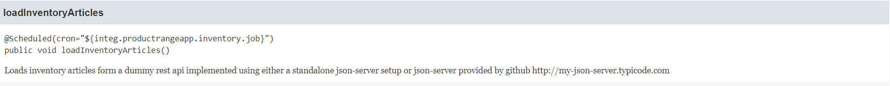
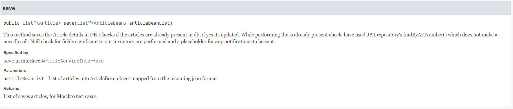
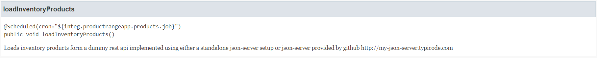
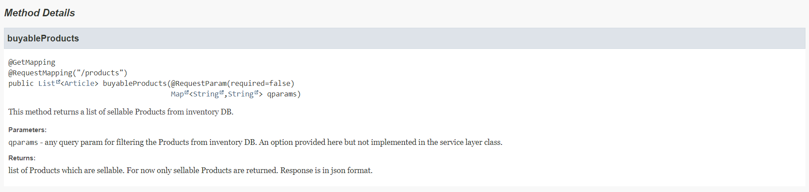
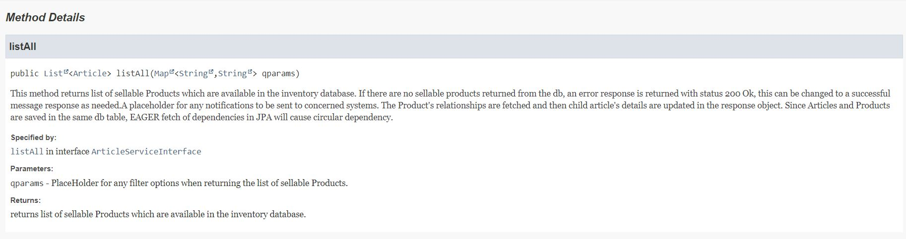
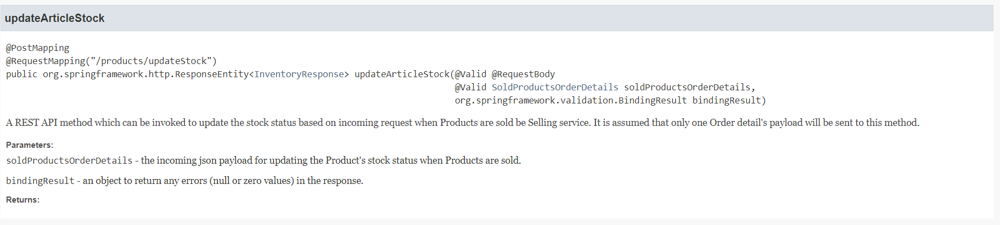
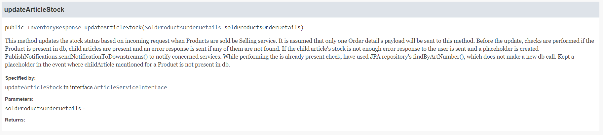

# Inventory system

An inventory management system which lets you to perform stock update in the event of new stock status available from downstream and Stock update on order capture from upstream services. 

## Getting Started

The inventory management system is a microservice developed using Spring Boot with REST APIs exposed. A dummy downstream service for loading Articles and Produtcs is simulated using a standalone json-server setup or json-server service leveraged using http://my-json-server.typicode.com

### Architectural plan & Assumptions

These assumptions are from a very high level architectural plan and is not a part of the deliverable of the assignment. 
The warehouse landscape will consist on multiple microservices interacting with each other using a service endpoint resolver solution. The landscape is assumed to be a hybrid setup. This microservice is one which will be hosted on cloud App service.

For application runtime environment, I have utilized the concept of containarisation and created a Docker Image which can utilized for application testing. It can be further pushed as a Docker Image to a private Image registry and Kubernetes environment can be leveraged for containerised application deployment. Having this assumption, the implementations/design/setup beyond the deliverable docker image is not in the scope here.
      
### Database Schema

**Article -** It holds Article and Product. The differentiation is saved in art_type column (Item and Product)

**ArticleRelationship -** It holds the Product and its Article's mapping along with the quantity of child Article needed in that Product

### Technology stack

* Spring Boot v2.4.4 
* Spring v5.3.5 
* Java 16
* MySql
* Maven 3.6.3

### Application development environment

**Profiles -** Default profile is used. Provision for production profile is created. Test environment profile is not created as of now.

**Credentials** are set as environment variables.

**application.properties** holds database, scheduler's schedules and paths used in the inventory service.

**application.yml** holds port number on which application runs and error reponse properties.

**log4j2.xml** holds the logging approach. Here using log4j for logging. Default SpringBoot implementation is logback, but log4j is easy to integrate with when it comes to log aggregation services.

### Functionalities implemented

**Application development -**

##### 1. Load Articles in inventory db - scheduled every 5 mins
Consuming REST API url from location http://my-json-server.typicode.com/sureverm/inventorysystem/inventory 
*ProductRangeAppIntegration.loadInventoryArticles()-->ArticleService.save(List\<ArticleBean>)-->repository.saveAll(List\<Article>)*
    

##### 2. Load Products in inventory db - scheduling option provisioned. For now its invoked after loadInventoryArticles()
Consuming REST API url from location http://my-json-server.typicode.com/sureverm/inventorysystem/products 
*ProductRangeAppIntegration.loadInventoryProducts()-->ArticleRelationshipService.saveArticleRelationship(List\<ProductBean>)-->ArticleRepository.saveAll(List\<Article>) and    ArticleRelationshipRepository.saveAll(List\<ArticleRelationship>)*
      

##### 3. REST API for returning list of sellable products http://localhost:8090/inventoryapp/api/v1/products
*InventoryController.buyableProducts()-->ArticleService.listAll(Map<String,String> queryParams)-->ArticleRepository.findAll()*

##### 4. REST API for updating stock staus http://localhost:8090/inventoryapp/api/v1/products/updateStock
*InventoryController.updateArticleStock(SoldProductsOrderDetails)-->ArticleService.updateArticleStock(SoldProductsOrderDetails)-->ArticleRepository.findByArtNumber(String articleNumber) and ArticleRepository.saveAndFlush(Article)*

**CICD**
 
A docker image to simulate the principle of containarisation for application runtime environment. It is for this assignment that the credentials are hardcoded in docker file. In a typical application service all the sensitive data must reside under Secrets/Key management services facilitated by the Cloud provider.

### Unfulfilled scenarios

Application development -
 * SSL enabled microservice and DNS set up.
 * Instead of considering new stock status update from file system a dummy downstream service is simulated using a json-server which returns inventory.json and products.json
 * A place holder to update/notify the concerned service about the stock status in the event when **count of articles in database < incoming article quantity to be updated**
 * User validation. Assumption is that a seperate microserice will be used here which will validate the user before forwarding the request to inventoryApp service.
 * Have not considered UI as its a service exposing REST APIs which can be consumed by any other service as long as it adheres to the interface contract provided by this service.
 * Wanted to use org.projectlombok for @Setter and @Getter, but have not used.

CICD - 
 * CI pipeline and docker image for building the application code with static code analysis check.

## Authors

* **Surekha Verma**

